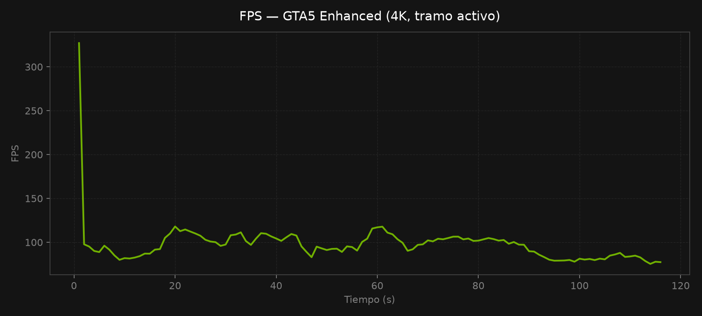
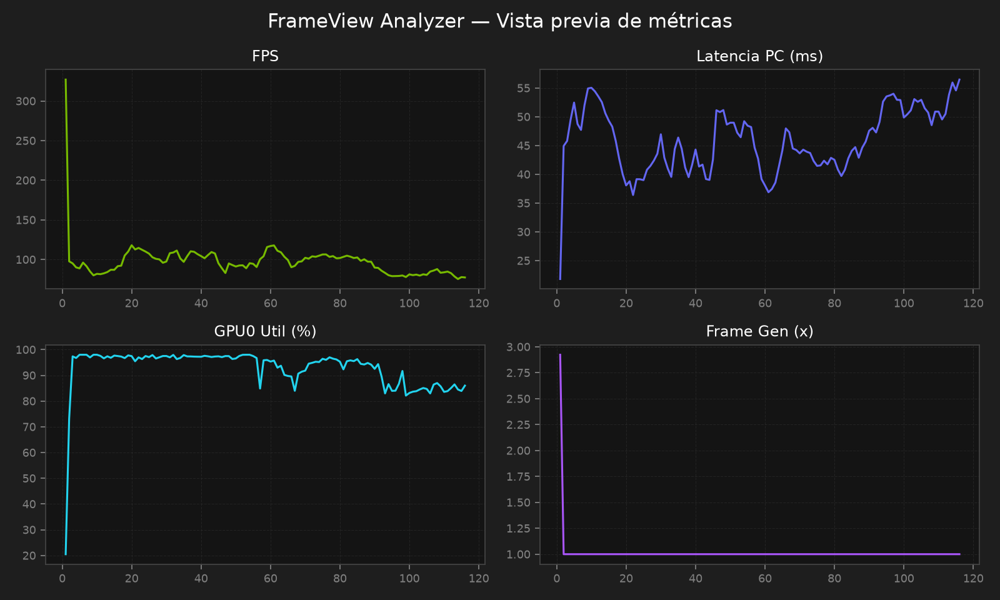
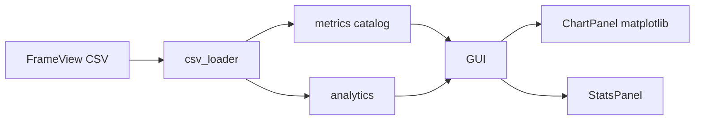

# FrameView Analyzer

[](https://www.python.org/)
[](LICENSE)
[](https://www.microsoft.com/windows)
[](https://www.nvidia.com/en-us/geforce/technologies/frameview/)
[](https://github.com/StreckerMX/frameview-analyzer)

**Analizador visual de métricas para logs CSV de NVIDIA FrameView.**

Carga tus sesiones de benchmark, compara configuraciones (DLSS, MFG, VSYNC, Path Tracing…) y explora **cada parámetro numérico** que exporta FrameView: FPS, latencia, frametime, GPU, CPU, energía, Frame Generation y más.

[Instalación rápida](#-instalación-rápida) · [Métricas](#-métricas-soportadas) · [Documentación](docs/METRICS.md) · [English](#english)

---

## Vista previa

| Gráfico FPS (tramo activo) | Panel de métricas |
|---|---|
|  |  |

*Datos reales de `FrameView_GTA5_Enhanced.exe` — 4K, RTX 5070 Ti.*

---

## Por qué usarlo

| Problema | Solución |
|----------|----------|
| Los CSV de FrameView tienen decenas de columnas difíciles de leer | Selector agrupado por categoría (Rendimiento, Latencia, GPU, CPU, Energía) |
| Menús y pantallas de carga distorsionan el promedio | **Filtro de tramo activo** por umbral de GPU |
| Quieres comparar dos pruebas (ej. MFG x2 vs x4) | Dos sesiones superpuestas en el mismo gráfico + delta de estadísticas |
| Necesitas compartir resultados | Exportar gráfico a **PNG** |

---

## Características

- **Logs `*_Log.csv`** — análisis frame a frame con agregación por segundo
- **42+ métricas** detectadas automáticamente del CSV (incluye núcleos CPU, clocks, potencia, etc.)
- **Estadísticas del tramo activo**: promedio, 1% low/high, 0.1% low/high, min y max
- **Comparación A/B** con colores distintos y panel de delta
- **Umbral GPU** automático o manual + recorte de bordes en segundos
- **Interfaz oscura** con acento NVIDIA (`#76B900`)
- **Instalación en un comando** vía PowerShell

---

## Requisitos

| Requisito | Detalle |
|-----------|---------|
| Sistema | Windows 10/11 |
| Python | 3.10 o superior |
| Origen de datos | [NVIDIA FrameView](https://www.nvidia.com/en-us/geforce/technologies/frameview/) |
| Archivo | `FrameView_*_Log.csv` (generado al detener la captura) |

Los logs se guardan por defecto en:

```
%USERPROFILE%\Documents\FrameView\
```

---

## Instalación rápida

### Opción A — Un comando (recomendado)

```powershell
Set-ExecutionPolicy -Scope Process -ExecutionPolicy Bypass; irm https://raw.githubusercontent.com/StreckerMX/frameview-analyzer/main/Install-Remote.ps1 | iex
```

- Instala en `%LOCALAPPDATA%\FrameViewAnalyzer`
- Crea entorno virtual `venv`
- Crea acceso directo en el escritorio: **FrameView Analyzer**
- Abre la aplicación automáticamente

Vuelve a ejecutar el mismo comando para **actualizar** sin perder el entorno.

### Opción B — Desde el repositorio

```powershell
git clone https://github.com/StreckerMX/frameview-analyzer.git
cd frameview-analyzer
python -m pip install -r FrameViewAnalyzer.Requirements.txt
python Start-FrameViewAnalyzer.py
```

### Opción C — PowerShell local

```powershell
.\Start-FrameViewAnalyzer.ps1
```

---

## Uso

1. Abre **FrameView Analyzer** (acceso directo o script de inicio).
2. Pulsa **Cargar sesión base** y selecciona un `*_Log.csv`.
3. Elige la métrica en el panel lateral (FPS, latencia, GPU, etc.).
4. *(Opcional)* Carga una **sesión comparativa** para superponer dos pruebas.
5. Ajusta el **umbral GPU** o deja el modo automático para filtrar menús/carga.
6. Revisa las **estadísticas** y exporta el gráfico con **Exportar gráfico PNG**.

### Ejemplo de flujo

```
FrameView (captura) → Documents\FrameView\FrameView_Juego.exe_*_Log.csv
                   → FrameView Analyzer (gráfico + stats)
                   → Comparar con otra configuración
                   → Exportar PNG para informe
```

---

## Métricas soportadas

### Principales (curadas)

| Métrica | Columna FrameView | Unidad | Interpretación |
|---------|-------------------|--------|----------------|
| FPS | `MsBetweenPresents` (calculado) | FPS | Más alto = mejor rendimiento |
| Frametime | `MsBetweenPresents` | ms | Más bajo y estable = más fluido |
| Latencia PC | `MsPCLatency` | ms | Más bajo = respuesta más directa |
| Frame Gen | `Frame Gen Multiplier` | x | 1 = nativo; variaciones = MFG activo/inactivo |
| GPU Util | `GPU0Util(%)` | % | Carga de GPU en el tramo activo |
| GPU Temp | `GPU0Temp(C)` | °C | Temperatura media/pico |
| CPU Util | `CPUUtil(%)` | % | Útil para detectar cuello de botella |
| Potencia GPU | `NV Pwr(W) (API)` | W | Consumo energético |
| Render Latency | `MsRenderPresentLatency` | ms | Latencia render → present |

### Automáticas

Cualquier **columna numérica adicional** del CSV se detecta y añade al selector: clocks, memoria, núcleos CPU (`CPUCoreUtil%[N]`), eficiencia `Perf/W`, batería, etc.

Documentación completa: **[docs/METRICS.md](docs/METRICS.md)**

---

## Filtro de tramo activo

FrameView registra también menús, pausas y pantallas de carga. El analizador:

1. Agrupa datos en ventanas de **1 segundo**
2. Detecta el tramo sostenido donde la GPU supera el **umbral** (%)
3. Descarta bins con GPU por debajo del umbral
4. Opcionalmente **recorta segundos** al inicio y fin del tramo

| Control | Descripción |
|---------|-------------|
| Umbral GPU automático | Calcula ~30% del uso medio de GPU (entre 5% y 40%) |
| Umbral GPU manual | Slider 0–80% |
| Recorte bordes | 0–10 s eliminados en cada extremo del tramo activo |

---

## Arquitectura



| Módulo | Responsabilidad |
|--------|-----------------|
| `csv_loader.py` | Lectura CSV, detección log/summary, valores numéricos |
| `metrics.py` | Catálogo de métricas + descubrimiento dinámico de columnas |
| `analytics.py` | Tramo activo, bins por segundo, percentiles |
| `chart_panel.py` | Gráficos matplotlib embebidos |
| `gui_app.py` | Interfaz CustomTkinter |

---

## Archivos del proyecto

```
frameview-analyzer/
├── frameview_analyzer/       # Código fuente Python
├── docs/
│   ├── METRICS.md            # Referencia de métricas
│   └── assets/               # Imágenes de preview
├── Install-Remote.ps1        # Instalador remoto
├── Uninstall-FrameViewAnalyzer.ps1
├── Start-FrameViewAnalyzer.py
├── Start-FrameViewAnalyzer.ps1
├── FrameViewAnalyzer.Requirements.txt
├── CHANGELOG.md
├── CONTRIBUTING.md
└── LICENSE
```

---

## Desinstalación

```powershell
Set-ExecutionPolicy -Scope Process -ExecutionPolicy Bypass; irm https://raw.githubusercontent.com/StreckerMX/frameview-analyzer/main/Uninstall-FrameViewAnalyzer.ps1 | iex
```

Elimina `%LOCALAPPDATA%\FrameViewAnalyzer` y el acceso directo del escritorio.

---

## Compatibilidad CSV

| Tipo | Patrón | Estado |
|------|--------|--------|
| Log detallado | `FrameView_*_Log.csv` | ✅ Gráficos + estadísticas |
| Resumen | `FrameView_Summary.csv` | ⏳ Planeado (solo agregados, sin serie temporal) |

---

## Roadmap

- [ ] Soporte `FrameView_Summary.csv` (tabla comparativa de sesiones)
- [ ] Atajo para carpeta `Documents\FrameView`
- [ ] Exportar estadísticas a CSV/JSON
- [ ] Modo oscuro/claro

Ver [CHANGELOG.md](CHANGELOG.md) para el historial de versiones.

---

## Contribuir

¿Ideas, bugs o nuevas métricas? Lee [CONTRIBUTING.md](CONTRIBUTING.md).

---

## Aviso legal

Este proyecto **no está afiliado a NVIDIA**. FrameView y PresentMon son propiedad de sus respectivos titulares. Úsalo bajo tu propia responsabilidad para análisis personal y de benchmark.

---

## Licencia

[MIT](LICENSE) — Copyright (c) 2026 StreckerMX

---

# English

**Visual analyzer for NVIDIA FrameView CSV logs.**

Load benchmark sessions, compare configs (DLSS, MFG, VSYNC, path tracing), and chart every numeric metric FrameView exports.

## Quick install

```powershell
Set-ExecutionPolicy -Scope Process -ExecutionPolicy Bypass; irm https://raw.githubusercontent.com/StreckerMX/frameview-analyzer/main/Install-Remote.ps1 | iex
```

## Run

Desktop shortcut **FrameView Analyzer** or:

```powershell
python Start-FrameViewAnalyzer.py
```

## Features

- Temporal charts from `*_Log.csv` files
- FPS, latency, frametime, GPU/CPU, power, Frame Gen, and auto-detected columns
- A/B session comparison with delta stats
- Active-segment GPU threshold filter
- PNG export

## License

MIT